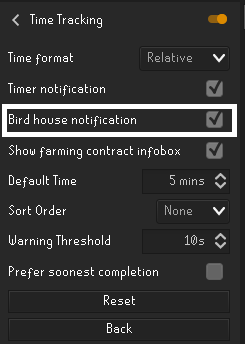
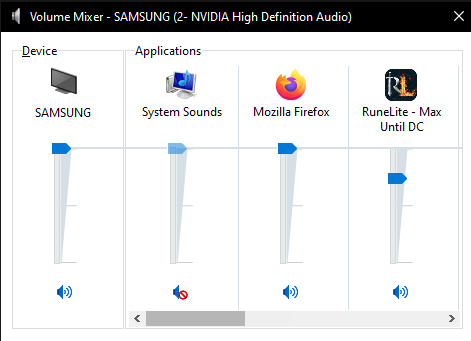

# Bird Run Alert

This is a bird run alert for those bird runs. It simply alerts when its bird run time.

Featuring fat_clouds. Check him out on his [twitch channel](https://www.twitch.tv/fat_clouds).

# Requirements

This plugin requires the default runelite `Time Tracking` plugin to be enabled and the `Birdouse notifiication` box to be checked.

# FAQ

## The plugin is too loud/quite

The volume of plugin is determined by your runelite volume. If you need to increase or lower the volume use the sound mixer on windows.

## The alert doesn't play

Double check you have the `Time Tracking` plugin enabled and the `Birdhouse notifiication` box checked. If it still does not work please open an issue and desribe what is happening.
